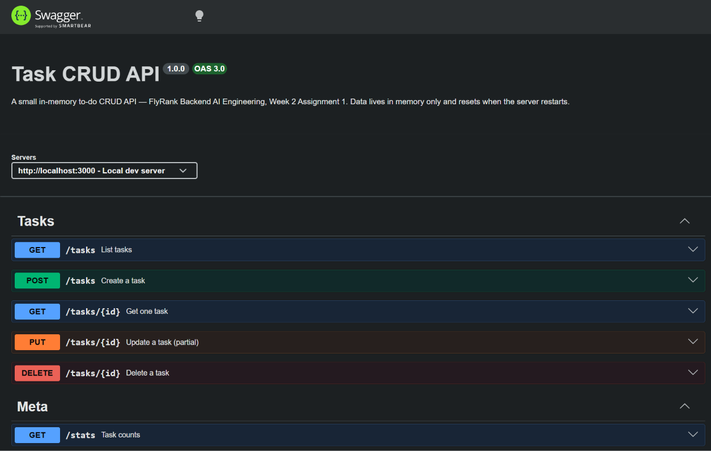
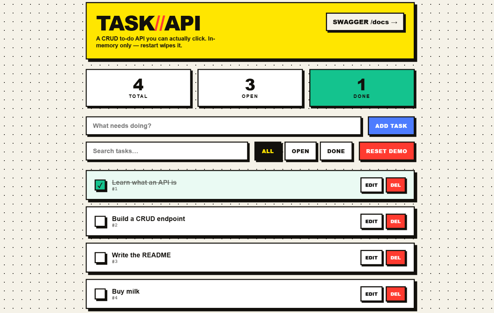

# Task CRUD API

A small REST API that manages a to-do list — **C**reate, **R**ead, **U**pdate, **D**elete — built for **FlyRank · Backend AI Engineering · Week 2 · Assignment 1 (BE-01)**.

Data lives **in memory only**. There is no database and nothing is written to disk — restarting the server wipes everything back to three seed tasks. That is deliberate (see [The mortality experiment](#the-mortality-experiment)).

It ships three ways to use the same API:

1. **A neobrutalist web UI** at `http://localhost:3000` — clickable, for non-technical users.
2. **Swagger UI** at `http://localhost:3000/docs` — interactive API docs, "Try it out".
3. **Plain HTTP** — `curl`, Postman, or anything that speaks JSON.

---

## Run it

Requires Node.js 18+.

```bash
npm install
npm run dev
```

That is the one documented command. The server starts on `http://localhost:3000`.

| What | Where |
|---|---|
| Web UI | http://localhost:3000 |
| Swagger UI | http://localhost:3000/docs |
| API info (JSON) | http://localhost:3000/api |

Other scripts: `npm test` (Vitest + supertest), `npm run build` (compile to `dist/`), `npm start` (run the compiled build).

---

## Endpoints

| Method | Path | Success | Errors | Notes |
|---|---|---|---|---|
| `GET` | `/` | 200 | — | Web UI (browser) or API-info JSON (curl/API clients) — see [The `GET /` decision](#the-get--decision) |
| `GET` | `/api` | 200 | — | API info `{name, version, endpoints}`, always JSON |
| `GET` | `/health` | 200 | — | `{status:"ok"}` |
| `GET` | `/tasks` | 200 | 400 | Supports `?done=`, `?search=`, `?limit=`, `?offset=` |
| `GET` | `/tasks/:id` | 200 | 404 | 404 → `{error:"Task 99 not found"}` |
| `POST` | `/tasks` | 201 | 400 | Body `{title}`; missing/empty title → 400 |
| `PUT` | `/tasks/:id` | 200 | 400, 404 | Partial update `{title?, done?}`; empty body → 400 |
| `DELETE` | `/tasks/:id` | 204 | 404 | Empty body on success |
| `GET` | `/stats` | 200 | — | `{total, done, open}` |
| `POST` | `/reset` | 200 | — | Restore the three seed tasks |

A **Task** is exactly `{ "id": number, "title": string, "done": boolean }`. Every error is JSON: `{ "error": "<message>" }`.

### Query parameters on `GET /tasks`

- `?done=true` / `?done=false` — filter by completion state
- `?search=milk` — case-insensitive title substring match
- `?limit=2&offset=1` — pagination (see [Why pagination](#why-pagination))

---

## Example: `curl -i`

Creating a task shows the status line, headers, and JSON body:

```
$ curl -i -X POST http://localhost:3000/tasks \
    -H "Content-Type: application/json" \
    -d '{"title":"Buy milk"}'

HTTP/1.1 201 Created
X-Powered-By: Express
Content-Type: application/json; charset=utf-8
Content-Length: 40
ETag: W/"28-PpSBYV7i68cXyGc7AhjVpkZkY5Q"
Date: Fri, 17 Jul 2026 19:00:12 GMT
Connection: keep-alive
Keep-Alive: timeout=5

{"id":4,"title":"Buy milk","done":false}
```

More checkpoints (Git Bash quoting — paste as-is):

```bash
curl -i http://localhost:3000/tasks             # 200 + 3 seed tasks
curl -i http://localhost:3000/tasks/99          # 404 + {"error":"Task 99 not found"}
curl -i -X POST http://localhost:3000/tasks -H "Content-Type: application/json" -d '{}'   # 400
curl -i -X PUT  http://localhost:3000/tasks/1 -H "Content-Type: application/json" -d '{"done":true}'  # 200
curl -i -X DELETE http://localhost:3000/tasks/1 # 204 (empty body)
```

---

## Swagger UI

Open `http://localhost:3000/docs`. Every endpoint is listed with its request/response schema; "Try it out" runs a real request against the live server, so the full CRUD cycle works in the browser.



> The OpenAPI spec is **generated from JSDoc `@openapi` comments** on the route handlers (`src/routes/tasks.routes.ts`) via `swagger-jsdoc` — it is derived from the code, not hand-maintained. This is the assignment's stretch goal.

---

## Web UI

A **neobrutalist** single-page task manager, served same-origin by Express from `public/`. No framework, no build step — plain HTML/CSS/JS. It surfaces the whole API visually: add, toggle done, inline-edit titles, delete, live search, all/open/done filters, a live stats bar, a reset-demo button, and success/error toasts (the red toasts show the API's own JSON `{error}` messages, so validation is visible to non-technical users).

The look is deliberately **not** the generic "AI theme" — no gradients, glow, or glassmorphism. Instead: paper background, 3px black borders, flat hard-offset shadows, an electric-yellow accent, and buttons that physically "press" on click.



> Open `http://localhost:3000` in a browser.

### The `GET /` decision

The assignment wants `GET /` to return API-info JSON; the UI wants `GET /` to serve the page. Both are satisfied with **content negotiation**: browsers (which send `Accept: text/html`) get the UI; plain `curl` and API clients get the JSON. `GET /api` is an always-JSON alias so a stable JSON root always exists. This keeps the `curl -i http://localhost:3000/` checkpoint returning JSON.

---

## Why the extra engineering

The base brief targets a beginner (≈100 lines of plain JS, no tests). This build applies senior engineering discipline while respecting every rule:

- **TypeScript + Zod** — the data model is defined once as Zod schemas and drives both runtime validation and the TS types. Validation is declarative, not a pile of manual `if` checks.
- **App-factory pattern** — `createApp()` is decoupled from the port listener (`src/server.ts`), so tests import a fresh app with supertest and never bind a port.
- **Vitest + supertest** — 25 integration tests assert every status code (200/201/204/400/404), non-reused ids, all validation paths, the extras, and the `GET /` negotiation. The assignment asks for none.
- **A central error handler** — malformed JSON and Zod failures both become clean `400 {error}` responses instead of leaking a 500 with a stack trace.

### Design choices worth calling out

- **IDs are never reused.** A monotonic counter assigns ids; deleting task 2 does not free id 2. This is more correct than `array.length + 1`, which collides after deletes.
- **The server never trusts the client.** `POST /tasks` ignores any client-sent `id`/`done` — it always assigns its own id and forces `done:false`.
- **Non-numeric ids are 404, not 500.** `GET /tasks/abc` is treated as "no such task".

### Why pagination

`GET /tasks?limit=&offset=` exists because **real APIs never return "everything"**. As a collection grows, an unbounded list means an ever-larger response: more bytes over the wire, higher latency, and more memory pressure on both server and client. Pagination lets a client ask for a bounded window (e.g. 20 at a time) and page through the rest, keeping every response fast and predictable regardless of how big the underlying dataset gets.

---

## The mortality experiment

Create a few tasks, then stop and restart the server. They are **gone** — the store is a plain in-memory array, so every restart resets to the three seeds. That is the whole point of this assignment: it makes the need for real persistence tangible, which is exactly the problem a database (Week 3) solves.

---

## Project structure

```
src/
  app/app.ts            createApp() — routes, static UI, docs, error handler
  data/store.ts         in-memory tasks + seed/reset + query/stats
  routes/               tasks.routes.ts (CRUD + extras), meta.routes.ts
  schemas/task.schema.ts  Zod model: Task, CreateTask, UpdateTask, query
  docs/openapi.ts       swagger-jsdoc config
  middleware/error.ts   central JSON error handler
  server.ts             listens on PORT (default 3000)
public/                 neobrutalist web UI (index.html, styles.css, app.js)
tests/                  Vitest + supertest (crud, validation, extras)
ai-version/             Stage 7 — one-shot AI build, quarantined & unedited
```

---

## Tech stack

Node.js · TypeScript · Express 5 · Zod · swagger-jsdoc + swagger-ui-express · Vitest + supertest · tsx.
